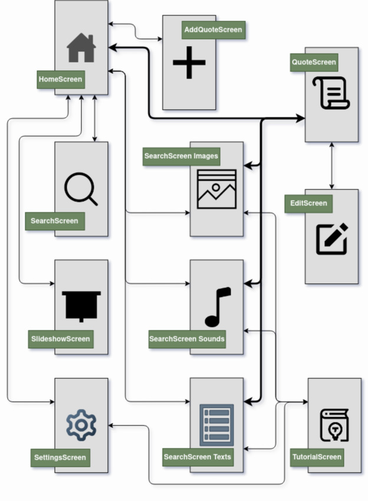

# 📚 qool-quotes

**qool-quotes** to minimalistyczna aplikacja na Androida, umożliwiająca przechowywanie i zarządzanie ulubionymi cytatami. Została stworzona z myślą o prostocie i przejrzystości, pozwalając użytkownikom na szybki dostęp do inspirujących treści.

## 🤖 Figma 

https://www.figma.com/design/jj5S3KtFLnJUHmaulfN186/Najlepsze-cytaty?node-id=14-644

## ✨ Funkcje

- Dodawanie, edytowanie i usuwanie cytatów
- Przechowywanie cytatów lokalnie na urządzeniu
- Intuicyjny i przejrzysty interfejs użytkownika
- Wykorzystanie nowoczesnych komponentów Androida

## 🛠️ Technologie

- **Język programowania**: Kotlin
- **Architektura**: MVVM (Model-View-ViewModel)
- **Baza danych**: Room
- **UI**: Jetpack Compose
- **Zarządzanie zależnościami**: Gradle Kotlin DSL

## 🚀 Rozpoczęcie pracy

Aby uruchomić projekt lokalnie:

```bash
git clone https://github.com/miloszratajczyk/qool-quotes.git
```

1. Otwórz projekt w Android Studio.
2. Zbuduj i uruchom aplikację na emulatorze lub fizycznym urządzeniu z Androidem.

## 📂 Struktura projektu

```
qool-quotes/
├── app/                   # Główna aplikacja Android
│   ├── src/
│   │   ├── main/
│   │   │   ├── java/      # Kod źródłowy w Kotlinie
│   │   │   └── res/       # Zasoby (layouty, stringi, itp.)
├── build.gradle.kts       # Plik konfiguracyjny Gradle
├── settings.gradle.kts    # Ustawienia projektu
├── gradle/                # Skrypty Gradle
└── README.md              # Ten plik
```
## 🗺️ Architektura aplikacji

Poniżej znajduje się poglądowy schemat architektury aplikacji:



## 📄 Licencja

Projekt udostępniony na licencji MIT. Szczegóły w pliku [LICENSE](LICENSE).


## 👥 Autorzy

- Miłosz Ratajczyk – [@miloszratajczyk](https://github.com/miloszratajczyk)
- Marcin Drebot – [@arciol](https://github.com/arciol)
- Mikołaj Swakoń – [@mixus-pwr](https://github.com/mixus-pwr)
